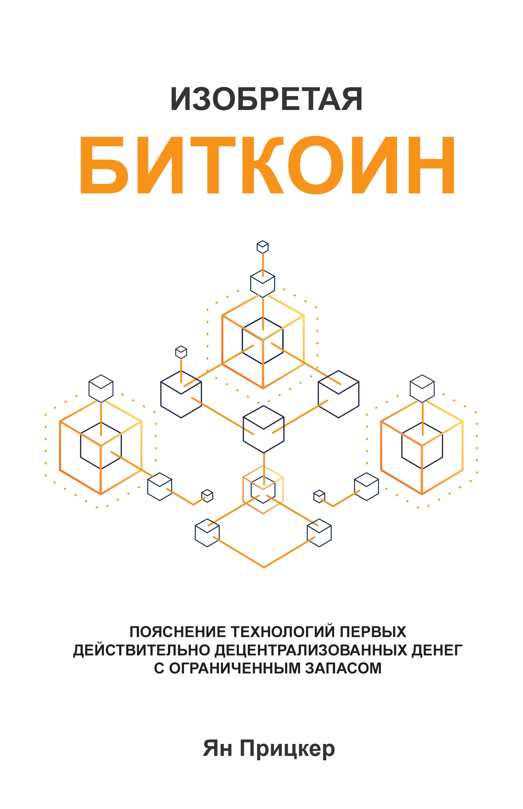

# Изобретаем Биткоин

"Изобретаем Биткоин" - книга-вступление к Биткоину. Прочитав ее вы познаете причины появления Биткоина, основы работы протокола и основные свойства и функции сети.

Поблагодарить автора книги Яна Прицкера за проделанную им работу можно в твиттере: https://twitter.com/skwp

Поддержать некоммерческий образовательный биткоин-онли проект 21идея, подготовивший перевод этой книги, можно, перейдя в [этот раздел](/contribute/)

Вперед к знаниям!

---

## Содержание: 

[ВСТУПЛЕНИЕ](./vstuplenie)  

Глава 1: ЧТО ТАКОЕ БИТКОИН  

Глава 2: ОТКАЗЫВАЕМСЯ ОТ ПОСРЕДНИКА  

Глава 3: PROOF OF WORK  

Глава 4: МАЙНИНГ  

Глава 5: ОБЕСПЕЧЕНИЕ БЕЗОПАСНОСТИ РЕЕСТРА  

Глава 6: ФОРКИ И АТАКИ 51  

Глава 7: УЧЕТНЫЕ ЗАПИСИ, НЕ ИДЕНТИФИЦИРУЮЩИЕ ЛИЧНОСТЬ  

Глава 8: КТО УСТАНАВЛИВАЕТ ПРАВИЛА?  

Глава 9: ЧТО ДАЛЬШЕ?


Книга также доступна для [скачивания](../epubs/inventing-bitcoin.epub) в формате epub.
